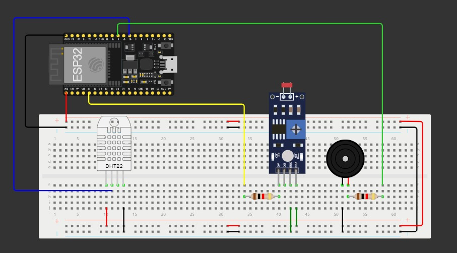

# Smart-Skin-Defense-and-Dermatological-Monitor-using-TinyML
# 🌞 Smart Skin Defense & Dermatological Monitor

A smart, embedded system for monitoring UV exposure and providing dermatological risk analysis using machine learning and sensor data. This project leverages a combination of microcontroller programming, TensorFlow Lite, and UV datasets to enhance skin protection awareness.

---

## 📁 Project Structure
```python
├── .pio/                          # PlatformIO build files
├── .vscode/                       # VSCode settings
├── include/                       # Header files
├── lib/                           # External libraries
├── sketch/                        # Sketches (Arduino-style)
├── src/                           # Source code for the firmware
├── test/                          # Unit tests
├── diagram.json                   # Wokwi simulation diagram
├── libraries.txt                  # Required PlatformIO libraries
├── model.py                       # Python script to train/export the model
├── model_uv.h                     # Converted model header for microcontroller use
├── model_uv.tflite                # Trained TFLite model
├── platformio.ini                 # PlatformIO configuration
├── unit-1_model.py                # Additional model training/experimentation
├── updated_uv_exposure_dataset.csv  # Dataset used for training
├── wokwi-project.txt              # Wokwi project metadata
├── wokwi.toml                     # Wokwi configuration
└── README.md                      # Project documentation

```
## 🎯 Objective

To create a portable device that:

- Continuously monitors UV radiation using sensors.
- Predicts skin risk levels using an ML model trained on UV exposure data.
- Notifies users in real-time when harmful exposure thresholds are detected.
- Offers insights for dermatological awareness and prevention.


## ⚙️ Technologies Used

- **Microcontroller**: ESP32 (via PlatformIO)
- **ML Framework**: TensorFlow / TFLite
- **Simulation**: Wokwi
- **Programming Languages**: Python, C++
- **IDE**: VS Code + PlatformIO

---

## 📦 Setup Instructions

### 1. Clone the Repo
```bash
git clone [https://github.com/your-username/skin-defense.git](https://github.com/Okay002/Smart-Skin-Defense-and-Dermatological-Monitor-using-TinyML.git)
cd Smart-Skin-Defense-and-Dermatological-Monitor-using-TinyML
```

### 2. Setup Python Environment
```bash
pip install -r requirements.txt
```

### 3. PlatformIO Setup
```bash
pip install platformio
```
Build and upload the firmware:
```bash
platformio run --target upload
```

🧠 Machine Learning Model
Trained using updated_uv_exposure_dataset.csv
Exported as .tflite for edge inference

Converted to C header (model_uv.h) for microcontroller deployment
To retrain or experiment:
```bash
python model.py
```

## 📦Hardware Setup
This project uses the following components:
ESP32 Microcontroller:The ESP32 is connected to a breadboard, where it will handle communication and data processing.

DHT22 Sensor:This is a temperature and humidity sensor. The sensor's connections are as follows:

VCC (Power) connected to the 3V pin of the ESP32.
GND (Ground) connected to the GND pin of the ESP32.
Data connected to a GPIO pin (as indicated by the blue wire in the image).

UV Sensor: The UV sensor, likely to measure UV radiation, has the following connections:

VCC connected to the 3V pin of the ESP32.
GND connected to the GND pin of the ESP32.
Data connected to a GPIO pin (as shown by the yellow wire).

Connections:
Ensure that the VCC pins of the DHT22 sensor and the UV sensor are connected to the 3V output of the ESP32.
GND pins from both sensors should be connected to the ground of the ESP32.
The data pins of the sensors are connected to appropriate GPIO pins on the ESP32, as shown in the diagram.




## 🧪 Wokwi Simulation
To simulate the device virtually:

Go to Wokwi Simulator
Upload diagram.json and wokwi.toml
Follow the setup to simulate sensors and logic virtually


## 🚀 Future Improvements
Mobile app connectivity for alerts
AI-powered skin lesion classification
Cloud logging of exposure data for dermatological analytics


